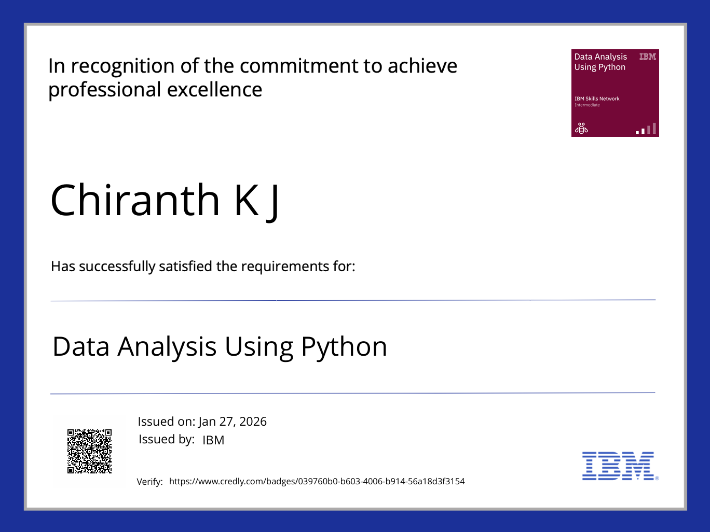
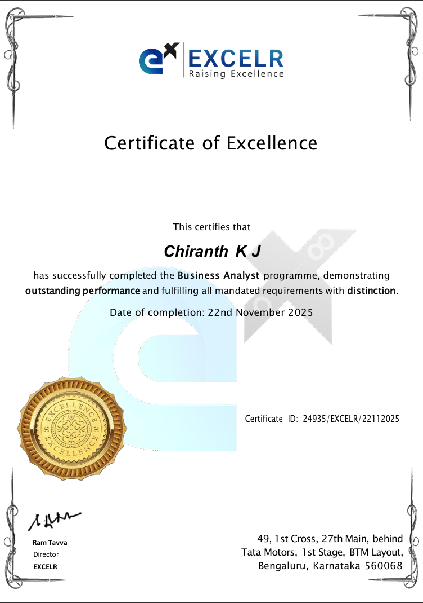

# Professional Certifications

## Data Analysis Using Python — IBM
**Issued:** January 2026  

This IBM-certified program focuses on Python-based data analysis, covering data cleaning, exploratory data analysis (EDA), and data visualization using industry-standard libraries.

**Skills Covered:**
- Python
- Data Analysis
- Pandas
- NumPy
- Data Visualization

🔗 Credential Verification:  
https://www.credly.com/badges/039760b0-b603-4006-b914-56a18d3f3154

---

## Business Analyst & Data Analytics Certification — ExcelR
**Issued:** November 2025  

This certification demonstrates proficiency in business analysis, MIS reporting, KPI tracking, and data analytics for business decision-making.

**Skills Covered:**
- Excel
- SQL
- Power BI
- Tableau
- Business Analytics
