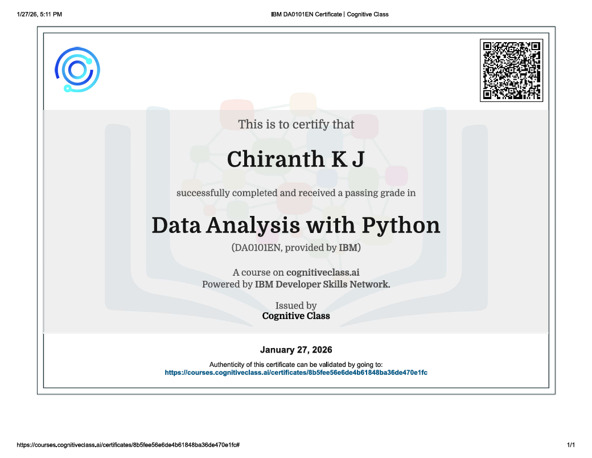
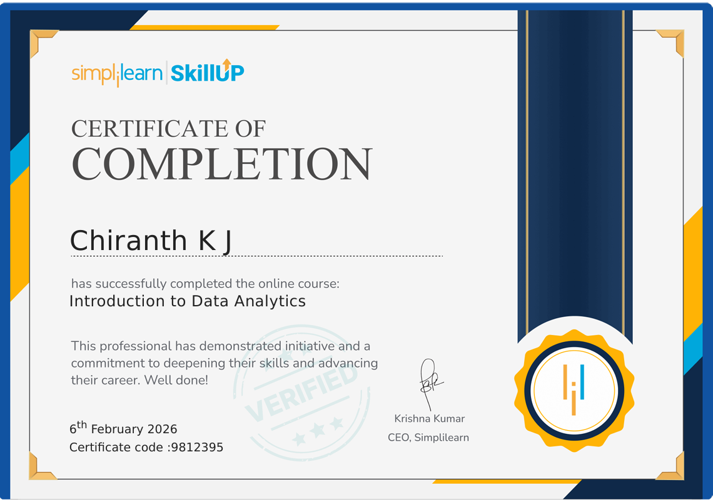

# Professional Certifications

## Data Analysis Using Python — IBM
**Issued:** January 2026  

---

This IBM-certified program focuses on Python-based data analysis, covering data cleaning, exploratory data analysis (EDA), and data visualization using industry-standard libraries.

**Skills Covered:**
- Python
- Data Analysis
- Pandas
- NumPy
- Data Visualization

🔗 Credential Verification:  
[https://courses.cognitiveclass.ai/certificates/8b5fee56e6de4b61848ba36de470e1fc]

---

## Business Analyst & Data Analytics Certification — ExcelR
**Issued:** November 2025  

This certification demonstrates proficiency in business analysis, MIS reporting, KPI tracking, and data analytics for business decision-making.

**Skills Covered:**
- Excel
- SQL
- Power BI
- Tableau
- Business Analytics
---

## Intoduction to Data Analytics Certification — SkillUp / Simplilearn
**Issued:** February 2026  

Completed Introduction to Data Analytics course covering data fundamentals, analytics lifecycle, types of data, and real-world business use cases for data-driven decision-making.

**Skills Covered:**
- Data Analytics Fundamentals
- Data-Driven Decision Making
- Types of Data (Structured & Unstructured)
- Analytics Lifecycle
- Descriptive Analytics
- Business Analytics 
